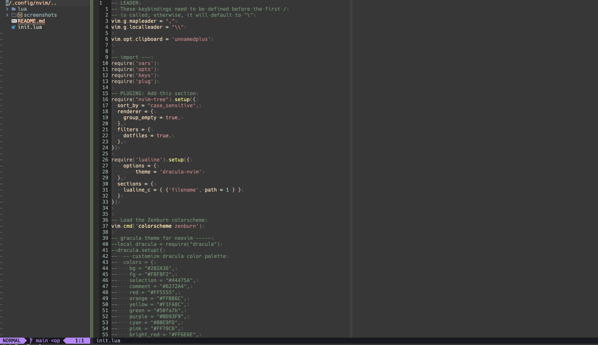
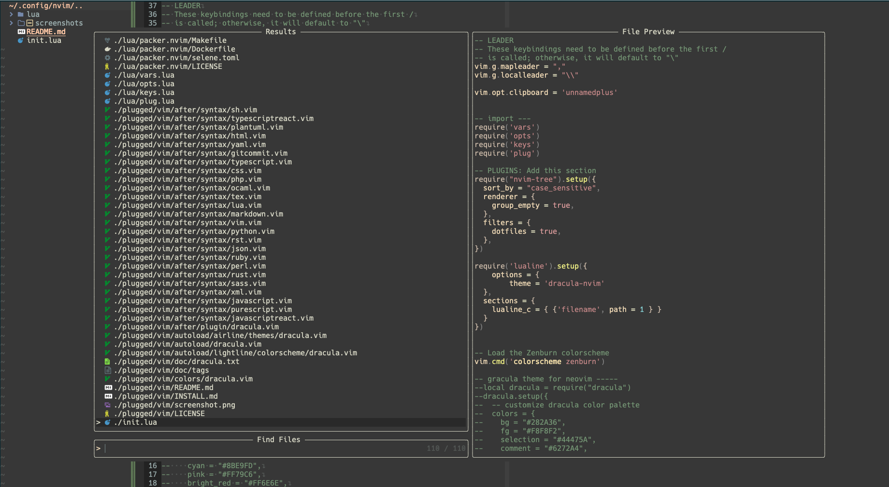

# awesome-neovim
This is my local setup of neovim 

# Instructions to setup
1. Install neovim version 0.9 using instructions [here](https://github.com/neovim/neovim/wiki/Installing-Neovim)
2. Install packer for dependency manager, instructions [here](https://github.com/wbthomason/packer.nvim)
3. Install `vimgrep` using `brew install ripgrep` on macbook
4. Install copilot using instructions [here](https://github.com/github/copilot.vim)

# What to expect

